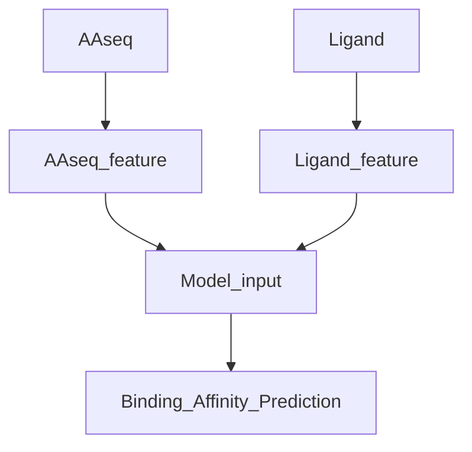

# Deep_Discovery 1/10
 Deep learning based protein-ligand affinity prediction.
 * BindingDB dataset [BindingDB dataset](https://www.bindingdb.org/rwd/bind/chemsearch/marvin/Download.jsp)

<details>

<summary>Features</summary>

1. Training Deepdiscovery model, weighted_loss (main.py)
2. Wandb logging
3. web <-> server inference (inference.py, host.py)
4. preprocessed bindingDB test dataset (datasets/classification_binding_DB_test_0.1)
5. Parsing 3D structure of AAseq and Ligands (utils/structure_parser.py)

</details>

**Here is a simple flow chart for model processing:


# 
### Train
- Run the following command:
```bash
# Train
python main.py --isTrain --n_epochs 30 --gpu_ids 0

# Train with weighted loss
python main.py --isTrain --weighted_loss --n_epochs 30 --gpu_ids 0

# Train from checkpoint
python main.py --isTrain --weight_pt "directory to weight file" --start_epoch "epoch to continue" --n_epochs 30 --gpu_ids 0

```

### Train with Wandb

- Run the following command:
```bash
wandb login
python main.py --isTrain --wandb
```

### Test

- Run the following command:
```bash
python main.py
```


